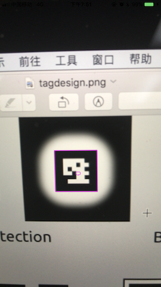
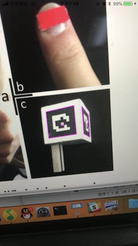
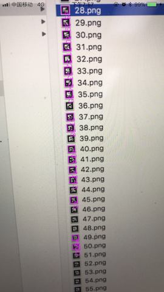

# talkit_private
iOS version of talkit

### Phase 1

An iOS app that can detect tags.

#### Content

This project contains the whole Xcode project except for the file `opencv2.framework`(too big to upload).

Here we use OpenCV 3.2.0, you can download it from https://sourceforge.net/projects/opencvlibrary/files/opencv-ios/3.2.0/opencv-3.2.0-ios-framework.zip/download

Then you can put the .framework file in folder `~/OpenCVSample_iOS`.

The project also contains source code from `Chilitags`.

`myChilitags.h` and `myChilitags.mm` are the functions of our own using `OpenCV` and `Chilitags`. They are linked to `ViewController.swift` by the bridging file.

In this Phase, we implemented getting images from Camera, transfer it into `cv::Mat` and detect tags in it. Then we retransfer it into image and print it. The essential function is `detectLive(UIImage *)`.

#### Dependencies

You should be using these tools:

1.  macOS 10.12.6+
2.  Xcode 9.0+
3.  iPhone 7, 7p, 8, 8p, X

*   iPhone is not necessary to be 7+ now in Phase 1 since we are not using ARkit right now.

#### Getting Started

After you put .framework file into the correct folder, you can launch the project and run it in your real devices.

Simulator is not recommended because we are using Camera.

If you wish to build a new project from our source code, you need to do those configurations:

1.  Add ` opencv2.framework` in OpenCVSample_iOS > Build Phases > Link Binary With Libraries
2.  Add `$(SRCROOT)/OpenCVSample_iOS/include` in OpenCVSample_iOS > Build Settings > Header Search Paths

#### Example

As you can see the following pictures, the detections of one tag, tags in cube and multiple tags are working just fine.

### Phase 2

Color Recognition and Speech Recognition

#### Color Recognition

Referenced from OpenCV C++ Tutorial

https://opencv-srf.blogspot.com/2010/09/object-detection-using-color-seperation.html

Because it only used OpenCV functions, I did not write it in the `myChilitags.mm` file.

We used cv::inRange to detect certain color, in this case, red.

Then remove small objects from the foreground using erode() and dilate()

Then calculate the center coordinates.

Job finished.

#### Speech Recognition

iOS10 provided APIs of speech recognition in real time using Audio Buffer.

First we request for authorization of microphone and speech recognition.

Then we begin the recognition task and get the result. It's simple.

Job finished.